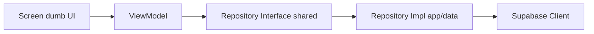

# Contributing to Tio Hub

Welcome to Tio Hub! This repository serves as the Android and Wear OS home for TNYX / Tio. We prioritize clean architecture, strict module boundaries, type-safe navigation, and a friendly, disciplined contributor experience.

This guide explains how to set up your local development environment, name branches, format commit messages, open pull requests, and maintain the codebase standards.

---

## 🛠️ Development Setup

Getting the project up and running locally is simple, but requires a few specific steps:

### 1. Requirements
*   **Android Studio:** Android Studio Jellyfish (2024.1.1) or newer is highly recommended.
*   **JDK:** JDK 21. Make sure your Android Studio is configured to use JDK 21 for Gradle builds (**Settings/Preferences -> Build, Execution, Deployment -> Build Tools -> Gradle -> Gradle JDK**).
*   **Android SDK:** API 35 platform tools and SDK platform package.
*   **Git:** Command-line client for cloning and managing branches.

### 2. Environment Variables (.env)
If you require API endpoints or publishable keys (e.g., Supabase anon key), copy `.env.example` to `.env` in the root directory:
```bash
cp .env.example .env
```
*Note: `.env` target configurations are automatically loaded by the Gradle build script but are ignored by Git. Kabhi bhi `.env` ko commit mat karein!*

### 3. Step-by-Step Sync & Build
1.  **Clone the repository:**
    ```bash
    git clone https://github.com/im-tnyx/Tio-hub.git
    cd Tio-hub
    ```
2.  **Open the Project:** Open Android Studio, select **Open**, and point specifically to the **`apps/`** subdirectory. Do not open the repository root directory as a project.
3.  **Gradle Sync:** Allow Gradle to download dependencies and sync configuration. If you face sync issues, verify that your Gradle JDK is explicitly set to JDK 21.
4.  **Run Build Checks:** Run a debug build from your IDE or the terminal to ensure everything is initialized correctly:
    *   **macOS/Linux:** `./gradlew assembleDebug`
    *   **Windows:** `.\gradlew.bat assembleDebug`

---

## 🌿 Branching Guidelines

We use focused, short-lived branch structures. Your branch should solve exactly one ticket or feature set.

### Branch Prefix Conventions
Name your branch using these prefixes:
*   `feature/<description>` — New features (e.g., `feature/nutrition-meal-editor`)
*   `fix/<description>` — Bug fixes (e.g., `fix/workout-timer-reset`)
*   `docs/<description>` — Documentation only (e.g., `docs/readme-updates`)
*   `refactor/<description>` — Structural refactoring without behavior change (e.g., `refactor/shared-workout-models`)
*   `test/<description>` — Adding or fixing unit tests (e.g., `test/diary-reducer-tests`)
*   `chore/<description>` — Updating dependencies, build files, etc. (e.g., `chore/version-bump`)

### Branch Rules
*   Keep your branch synchronized with the `main` branch before opening a PR.
*   Avoid mixing large architectural changes with small documentation updates.
*   **No Generated Files:** Verify that you don't commit IDE files (`.idea/`), local gradle configurations, build outputs (`build/`), or target APK/AAB files.

---

## 📝 Commit Message Style

We follow the conventional commit standard. Make sure your commit messages are clear, direct, and explain *what* is changing.

### Good Commit Examples
*   `docs: add setup instructions to contributing guide`
*   `fix: resolve navigation crash on empty workout id`
*   `feature: create nutrition diary ViewModel and contract`
*   `refactor: extract exercise row composable to feature widgets`
*   `test: assert onboarding targets are correctly reduced`

### Bad Commit Examples (Avoid these!)
*   `fix bugs`
*   `update code`
*   `WIP`
*   `changes made`

---

## 🏗️ Coding Standards & Abstractions

To keep Tio-hub maintainable as it scales, you must strictly follow these engineering principles:

### 1. Clean Architecture Boundaries
Modules are divided according to their dependencies:
*   **`apps/shared` (Pure Kotlin)**: Contains pure Kotlin domain models, repository interfaces, and core business use cases. **Strict rule:** Compose or Android UI dependencies (`androidx.*`, `android.*`) are not allowed here to ensure future Kotlin Multiplatform (KMP) iOS readiness.
*   **`apps/core` (Design System & Platform Shell)**: Houses `TnyxTheme`, common UI buttons, text fields, cards, custom fonts, and core shells. Core can never import feature modules.
*   **`apps/features/<feature_name>`**: Independent modules owning feature screens, ViewModels,Contracts, and internal navigation subgraphs. Features can depend on `core` and `shared`, but they cannot import other features.
*   **`apps/app` (Application wiring)**: App entry (`MainActivity`), Hilt configuration modules, and global routing hosts.

### 2. MVI Presentation Pattern
Every feature screen or workflow must follow the unidirectional state pattern:
```text
Route (Glue) ──> ViewModel (Controller) ──> Contract ──> Screen (Dumb UI)
```
*   **`Contract`**: Declares immutable `UiState` (what to show), `Action` (user intents), and `Effect` (one-time navigation/toast events) for a screen.
*   **`Route`**: Entry Composable that collects flow state using `collectAsStateWithLifecycle()`, handles ViewModel injections, and intercepts single-use UI effects (e.g., triggering navigation).
*   **`ViewModel`**: Processes UI `Action` entries, updates `UiState`, emits events, and interacts with domain use cases/repositories.
*   **`Screen`**: Pure declarative rendering engine. It accepts `UiState` and outputs lambda events (`(Action) -> Unit`). **Hard rule:** Screen inside UI composables must never access database layers, API endpoints, or direct navigation controllers.

### 3. Type-Safe Navigation
All navigation entries must be type-safe using Kotlin Serialization:
*   Define serializable models for destination routing inside `apps/core/src/main/java/com/tnyx/core/routing/routes/`:
    ```kotlin
    @Serializable
    sealed interface WorkoutRoute {
        @Serializable
        data object History : WorkoutRoute
        @Serializable
        data class ActiveSession(val routineId: String?) : WorkoutRoute
    }
    ```
*   Raw string routes are strictly forbidden.

### 4. Supabase Temporary Abstraction & Repository Pattern
Currently, many modules use hardcoded/mock data. As we scale, this must be incrementally replaced with Supabase persistence. When migrating a feature to persistent storage, you **must** use the repository pattern:



#### Step-by-Step Migration Pattern:
1.  **Define Interface in `:shared`:** Create a repository interface inside the shared domain workspace (e.g., `apps/shared/nutrition/domain/repository/NutritionRepository.kt`).
    ```kotlin
    interface NutritionRepository {
        fun getDiaryEntries(date: LocalDate): Flow<List<MealEntry>>
        suspend fun saveMeal(entry: MealEntry)
    }
    ```
2.  **Define Models in `:shared`:** Ensure domain models (like `MealEntry` above) are pure Kotlin data classes.
3.  **Implement in `:app` or Data Module:** Place the Supabase client logic inside the implementation class:
    ```kotlin
    class SupabaseNutritionRepository @Inject constructor(
        private val supabaseClient: SupabaseClient
    ) : NutritionRepository { ... }
    ```
4.  **Hilt Dependency Injection:** Bind the interface to the implementation inside a Hilt module in `apps/app`. ViewModels should only depend on the interface:
    ```kotlin
    @HiltViewModel
    class DiaryViewModel @Inject constructor(
        private val nutritionRepository: NutritionRepository
    ) : ViewModel() { ... }
    ```
5.  **Dumb UI Boundary:** Screens must remain unaware of Supabase tables, row keys, or table models. They strictly interact with domain entities via the `UiState`.
6.  **Security & RLS (Row Level Security):** When creating database migrations/tables on Supabase, configure Row Level Security (RLS) policies. **Caution:** Never write client code using the `service_role` or admin keys; only use publishable client keys.

---

## 📥 Pull Request Process

Follow this workflow before requesting a review:

1.  **Run Tests locally:** Make sure your codebase compiles and passing tests:
    ```bash
    ./gradlew test
    ```
2.  **Lint Check:** Ensure code matches style guidelines:
    ```bash
    ./gradlew lint
    ```
3.  **Create the PR:** Fill in the template details clearly.

### Pull Request Template
```markdown
## Summary
Brief description of the changes introduced by this PR.

## Why
Explain the problem being solved or the feature being added.

## Architecture Notes
- Which modules were affected?
- Are Clean Architecture boundaries respected?
- Did you update navigation graphs/Serializable routes?

## Verification
Explain how you tested this change:
- [ ] `./gradlew test` passes.
- [ ] Tested on Android emulator/physical device.
- [ ] Wear OS sync verified (if applicable).

## Screenshots / Screen Recordings
Include visual outputs for UI modifications.
```

---

## 🛡️ Security Guidelines

*   **No committed secrets:** Keystores, API secrets, `.env` file credentials, or Firebase key files must never be committed.
*   If you introduce a new dependency, ensure it is declared in Gradle's Version Catalog (`libs.versions.toml`).

---

## 📞 Need Help?

If you are stuck on a design pattern or database architecture:
1.  Review nearby module implementations for reference code.
2.  Check the documentation in `apps/docs/`.
3.  Ask in active developer Slack channels or open a draft PR with your questions.

*Good contribution is not just writing code; clean boundaries and design guidelines follow karna hi code quality bar hai. Happy coding!*
