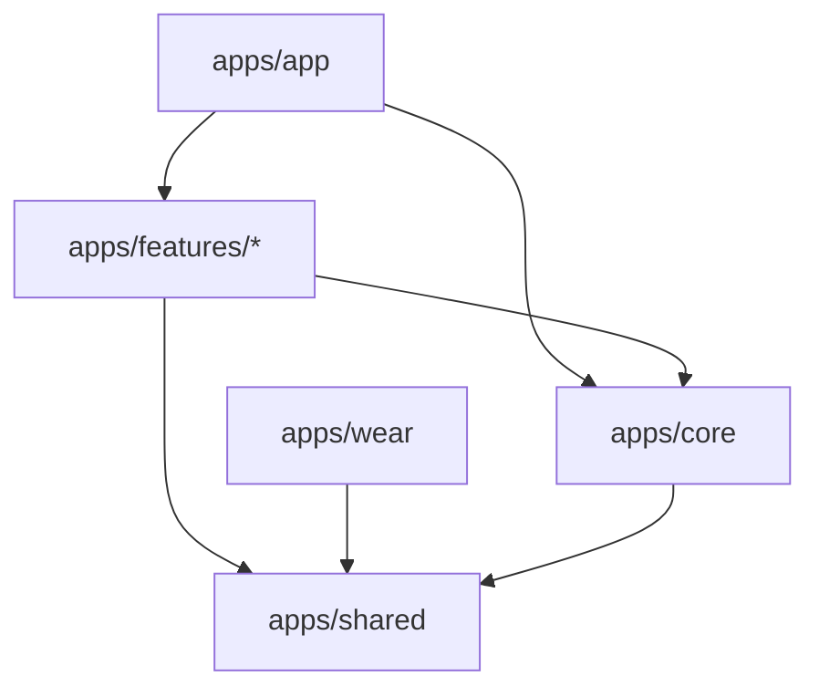

# Tio Hub

Tio Hub is the Kotlin/Android and Wear OS engineering home for **TNYX / Tio** — a premium, AI-powered health, fitness, nutrition, recovery, and coaching companion.

This repository is built with a simple architectural promise: **Product features can grow fast, but boundaries stay clean.** UI remains dumb, business rules stay in ViewModel/domain layers, navigation stays type-safe, and persistence details are introduced through repository abstractions rather than leaking into screens.

Documentation Baseline: This root `README.md` and the documents under `apps/docs/` serve as the absolute source of truth for all engineering implementations.

---

## 🧭 Project Vision

Build an exceptionally fast, visual, and AI-enabled health platform. Whether tracking a complex workout, managing daily macro goals, or reviewing wearable recovery inputs, the app must feel premium, fluid, and robust.

> **Note for Contributors:**
> **Tio-hub ka core philosophy hai clean separation.** Agar aap naye dev hain, welcome aboard! Pehle documentation check karein, module boundaries ko samjhein, aur phir hi custom implementation shuru karein. Code change agar architecture badalta hai, to docs ko update karna mandatory hai.

---

## 📱 Feature Highlights

The Tio platform is divided into several modular capability blocks:

| Feature | Capabilities | Implementation Status |
| :--- | :--- | :--- |
| **📱 Onboarding** | Welcome intro paths, personalized data collection (age, gender, height, weight, target goals), mobile OTP integration, and setup summaries. | Active / Modular Flow |
| **🥗 Nutrition Diary** | Calorie calculation, protein/carb/fat macro-tracking, dynamic meal editing, water logs, and custom glass size settings. | Active / Moving to DB |
| **🏋️ Workout Engine** | Routine planning, exercise explorer, active session tracker (rest timer, plate calculator, RPE tracking), and detailed workout history logs. | Active / Modular Flow |
| **📈 Progress Center** | Weight logs, body measurements, photo timeline, achievements, and goal pace calculations. | Skeleton UI / Active |
| **⌚ Wear OS Sync** | Workout tracking on Wear OS devices, heart rate syncing, tile controls, and offline watch session caching. | Active / Companion |
| **🤖 AI Coach** | Recovery scoring, sleep analysis, heart rate variability (HRV) context, and automated workout adjustments. | Planned |

---

## 🛠️ Tech Stack

Tio Hub uses a modern, opinionated Android stack to ensure high performance and code quality.

| Component | Choice | Details |
| :--- | :--- | :--- |
| **Language** | Kotlin | Modern JVM/KMP language |
| **UI Framework** | Jetpack Compose + Material 3 | Declarative design system based on `TnyxTheme` |
| **Architecture** | Multi-module Clean Architecture | MVI presentation layer |
| **DI** | Dagger Hilt | Compile-time checked dependency injection |
| **Navigation** | Compose Navigation | Type-safe navigation using `@Serializable` routes |
| **Async** | Kotlin Coroutines + Flow | Reactive stream handling and background worker threads |
| **Serialization** | Kotlin Serialization | `kotlinx.serialization` for stable REST & route contracts |
| **Data Layer** | Supabase Android SDK | Incremental Supabase repository abstraction with offline cache |
| **Build System** | Gradle Kotlin DSL | Modular build configurations with Version Catalogs (`libs.versions.toml`) |
| **Java Version** | JDK 21 | Long-term support release |
| **SDK Targets** | Min: API 26 / Target: API 35 | Target Android 15 features |

---

## 🏗️ Project Structure

The project code resides in the `apps/` directory, which represents a modular Gradle workspace. Below is the folder layout showing the main boundaries:

```text
Tio-hub/
├── .github/              # GitHub Action workflows, issue templates, and CODEOWNERS
├── apps/                 # Root directory for the Android/Wear OS project
│   ├── app/              # Phone app entry, MainActivity, Hilt DI graphs, AppNavHost routing
│   ├── core/             # Design system (TnyxTheme), reusable widgets, common shells, global routes
│   ├── features/         # Independent feature modules (auth, onboarding, nutrition, workout, etc.)
│   ├── shared/           # Pure Kotlin domain models and repository contracts shared between Phone & Watch
│   ├── wear/             # Wear OS application entry point, watch screens, and synchronization logic
│   └── docs/             # Canonical project architecture, navigation, and testing guides
├── CONTRIBUTING.md       # Contributing rules, branching policy, and PR template
├── CODE_OF_CONDUCT.md    # Contributor Covenant Code of Conduct
├── LICENSE               # MIT License details
└── .env                  # Local workspace secrets (not committed to git)
```

### Module Responsibilities at a Glance



1. **`apps/app` (App Shell & Wiring)**: Wires feature modules together. Holds navigation graphs (`AppNavHost.kt`), configuration classes, and application class setups.
2. **`apps/core` (Design System & Chrome)**: Houses the `TnyxTheme` colors, fonts, spacing values, reusable widgets, and common chrome overlays (`MainBottomNav`, `WorkoutSecondaryNav`). **Important:** Core can never import feature modules.
3. **`apps/features/*` (Domain Isolation)**: Independent features (e.g. `onboarding`, `workout`, `nutrition`). Feature screens must be completely isolated, exchanging navigation via public route contracts.
4. **`apps/shared` (Domain Models & Interfaces)**: Pure Kotlin library. Contains common domain models and repository contracts. No Android UI dependencies (`androidx.compose`) are allowed here, keeping the domain layer KMP-ready.
5. **`apps/wear` (Wear OS App)**: Target for wearable logic, showing heart rate telemetry and quick tracking shortcuts.

---

## 🚀 Getting Started

Follow these steps to set up the project locally:

### 1. Prerequisites
Make sure your workstation has:
- **Android Studio** (Jellyfish 2024.1.1 or newer recommended)
- **JDK 21** installed and configured in your IDE
- **Android SDK** with target API 35 tools installed
- **Git** command line utility

### 2. Clone and Initialize
```bash
# Clone the repository
git clone https://github.com/im-tnyx/Tio-hub.git
cd Tio-hub

# Create a local environment file
cp .env.example .env  # Update local variables if required
```

### 3. Open in Android Studio
1. Open Android Studio.
2. Select **Open an Existing Project** and target the **`apps/`** folder (not the repository root).
3. Allow Gradle to sync dependencies and index the project structure.

### 4. Build from Terminal
To verify the configuration, run a test build:
*   **macOS / Linux:**
    ```bash
    cd apps
    ./gradlew :app:assembleDebug
    ```
*   **Windows (PowerShell):**
    ```powershell
    cd apps
    .\gradlew.bat :app:assembleDebug
    ```

---

## 📚 Documentation Index

Before modifying routing logic, design tokens, database structures, or onboarding sections, read the corresponding documentation:

| Area | Documentation Path |
| :--- | :--- |
| **Engineering Rules** | [`apps/docs/ENGINEERING_GUIDELINES.md`](apps/docs/ENGINEERING_GUIDELINES.md) |
| **Definition of Done** | [`apps/docs/DEFINITION_OF_DONE.md`](apps/docs/DEFINITION_OF_DONE.md) |
| **Architecture Deep-dive**| [`apps/docs/ARCHITECTURE.md`](apps/docs/ARCHITECTURE.md) |
| **Type-Safe Navigation** | [`apps/docs/NAVIGATION_GUIDE.md`](apps/docs/NAVIGATION_GUIDE.md) |
| **Supabase Setup Plan** | [`apps/docs/SUPABASE_INCREMENTAL_SETUP_PLAN.md`](apps/docs/SUPABASE_INCREMENTAL_SETUP_PLAN.md) |
| **Profile & Settings** | [`apps/docs/PROFILE_SETTINGS_GUIDE.md`](apps/docs/PROFILE_SETTINGS_GUIDE.md) |
| **Testing Strategy** | [`apps/docs/TESTING_GUIDE.md`](apps/docs/TESTING_GUIDE.md) |
| **Wear OS Sync Plan** | [`apps/docs/WEAR_OS_PLAN.md`](apps/docs/WEAR_OS_PLAN.md) |

---

## 🤝 Contributing

We welcome contributions of all sizes. To understand our workflow:
1. Review [`CONTRIBUTING.md`](CONTRIBUTING.md) for branch naming conventions, PR templates, and coding guidelines.
2. Ensure you run `./gradlew test` before submitting changes.
3. Keep commits readable using standard prefix formats (e.g. `feature:`, `fix:`, `refactor:`, `docs:`).

---

## 📜 License

Tio Hub is licensed under the MIT License. See the [`LICENSE`](LICENSE) file for details.

---

## 🛡️ Code of Conduct

We are committed to a welcoming and professional community environment. Review [`CODE_OF_CONDUCT.md`](CODE_OF_CONDUCT.md) for standards, expectations, and reporting procedures.

---

## 📞 Contact & Support

For architectural queries, support, or sync meetings:
*   **Engineering Lead:** TNYX Engineering (engineering@tnyx.com)
*   **Active Discussions:** Slack/Discord developer channels
