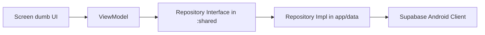

# Contributing to Tio-hub

Welcome to Tio-hub. Yeh repo **TNYX/Tio** ke Android and Wear OS product ka foundation hai. We care about clean architecture, a predictable review process, and a friendly contributor experience.

This guide explains how to set up your local development environment, choose the right module, create branches, open PRs, and keep code aligned with the existing Tio-Ledger-style documentation discipline.

---

## 🛠️ Project Overview

Tio-hub is a modular Kotlin Android/Wear repository for an AI-powered health, fitness, nutrition, workout, progress, and coaching app.

The project is intentionally modular:
```text
apps/
├── app/        # Android phone app entry, DI, app-level navigation
├── core/       # Design system, reusable UI, shell, global route definitions
├── features/   # Feature-owned app areas
├── shared/     # Pure Kotlin domain contracts for phone/watch reuse
└── wear/       # Wear OS app
```

Current feature modules include:
*   `features/auth`
*   `features/onboarding`
*   `features/nutrition`
*   `features/workout`
*   `features/profile`
*   `features/settings`
*   `features/progress`

Future feature ownership is documented in `apps/docs/ARCHITECTURE.md` and `apps/docs/PROFILE_SETTINGS_GUIDE.md`. *Agar doubt ho ki code kahan jaana chahiye, docs ko source of truth maano.*

---

## 💻 Development Setup

To build and run the project locally, set up your workspace using these specifications:

### 1. Prerequisites
*   **Android Studio:** Android Studio Jellyfish (2024.1.1) or newer is recommended.
*   **JDK:** JDK 21. Ensure your IDE's Gradle JDK setting points to JDK 21.
*   **Android SDK:** Compile/Target SDK API 35 platform tools.
*   **Git:** Command-line or integrated VCS tools.

### 2. Environment Configuration
If your feature requires runtime configurations, create a local `.env` file at the root of the repository:
```bash
cp .env.example .env
```
> [!WARNING]
> Keep local credentials confidential. Never commit `.env` files to remote repository branches.

### 3. Step-by-Step Gradle Sync & Terminal Setup
1.  **Open the workspace:** Open Android Studio, click **Open**, and select specifically the **`apps/`** directory.
2.  **Gradle sync:** Let the IDE sync gradle dependencies.
3.  **Terminal verification:** Verify the configuration by running:
    *   *macOS/Linux:*
        ```bash
        cd apps
        ./gradlew :app:assembleDebug
        ```
    *   *Windows PowerShell:*
        ```powershell
        cd apps
        .\gradlew.bat :app:assembleDebug
        ```

---

## 📚 Documentation First

Before changing architecture, navigation, module ownership, Supabase boundaries, onboarding flow, or testing strategy, read the relevant docs:

| Area | Read First |
| :--- | :--- |
| **Module boundaries** | [`apps/docs/ARCHITECTURE.md`](apps/docs/ARCHITECTURE.md) |
| **Navigation** | [`apps/docs/NAVIGATION_GUIDE.md`](apps/docs/NAVIGATION_GUIDE.md) |
| **Profile/Settings ownership** | [`apps/docs/PROFILE_SETTINGS_GUIDE.md`](apps/docs/PROFILE_SETTINGS_GUIDE.md) |
| **Onboarding** | [`apps/docs/ONBOARDING_FLOW_DETAILED.md`](apps/docs/ONBOARDING_FLOW_DETAILED.md) and [`apps/docs/TNYX_MODULAR_ONBOARDING.md`](apps/docs/TNYX_MODULAR_ONBOARDING.md) |
| **Nutrition** | [`apps/docs/NUTRITION.md`](apps/docs/NUTRITION.md) |
| **Supabase/data migration** | [`apps/docs/SUPABASE_INCREMENTAL_SETUP_PLAN.md`](apps/docs/SUPABASE_INCREMENTAL_SETUP_PLAN.md) |
| **Tests** | [`apps/docs/TESTING_GUIDE.md`](apps/docs/TESTING_GUIDE.md) |
| **Wear OS** | [`apps/docs/WEAR_OS_PLAN.md`](apps/docs/WEAR_OS_PLAN.md) and [`apps/docs/WEAR_OS_PROGRESS.md`](apps/docs/WEAR_OS_PROGRESS.md) |

> [!IMPORTANT]
> *Rule simple hai: code change agar architecture behavior badalta hai, docs bhi update honge.*

---

## 🌿 Branching Guidelines

Use focused branches. Naming standards:
```text
feature/<short-description>
fix/<short-description>
docs/<short-description>
refactor/<short-description>
test/<short-description>
chore/<short-description>
```

### Examples:
*   `feature/nutrition-meal-editor`
*   `fix/workout-secondary-nav-restore`
*   `docs/contributor-guide`
*   `refactor/shared-workout-contracts`

### Branch rules:
*   One branch should solve one meaningful problem.
*   Avoid mixing docs, large refactors, and feature work unless they are part of the same change.
*   Keep PRs reviewable. Chhota PR fast merge hota hai.
*   Do not commit generated files, build outputs, local IDE files, `.env`, APK/AAB artifacts, or keystores.

---

## 📩 Pull Request Process

Before opening a PR:
1.  Sync with the target branch (`main`).
2.  Run the most relevant Gradle checks.
3.  Confirm module boundaries are respected.
4.  Update docs if behavior or architecture changed.
5.  Check that no secrets or local files are committed.

### Pull Request Template
Your PR description should include:

- What changed
- Why it changed
- Screenshots or screen recordings for UI changes
- Tests/checks run
- Any known follow-up work

Suggested PR template:

```markdown
## Summary
- Brief description of the changes.

## Why
- Reason for the changes.

## Architecture Notes
- Details on boundary changes, route creations, or database adjustments.

## Tests
- [ ] `./gradlew test` passes.
- [ ] `./gradlew :app:compileDebugKotlin` verified.
- [ ] Manual UI check completed.

## Screenshots / Screen Recordings
(Add visual assets if UI has changed)
```

### Review expectations:
*   Respond to review comments respectfully.
*   Prefer small follow-up commits over force-pushing during active review unless cleanup is requested.
*   If a reviewer asks for an architecture reason, answer with module ownership and docs references.
*   If you disagree, explain tradeoffs calmly. Healthy technical disagreement is welcome.

---

## 📝 Commit Message Style

Use clear, direct commits:
```text
docs: add contributing guide
fix: keep workout secondary nav state from back stack
feature: add meal item editor contract
refactor: move shared workout model to shared module
test: cover nutrition diary state reducer
```

Avoid vague commits like:
*   `update`
*   `final changes`
*   `bug fix`
*   `misc`

---

## 📐 Code Standards

### 1. Clean Architecture Boundaries
Follow the module ownership rules:
*   **`apps/shared`** contains pure Kotlin domain models, repository interfaces, and use cases that need phone/watch reuse. **No Compose or Android UI dependencies (`androidx.*`, `android.*`) are allowed here to preserve KMP capabilities.**
*   **`apps/core`** contains reusable design system components, themes, shells, global routing primitives, and feature-agnostic UI.
*   **`apps/features/<feature>`** owns feature presentation, feature navigation, and feature-specific logic.
*   **`apps/app`** wires the Android app, DI, root nav host, and platform implementations.
*   **`apps/wear`** owns Wear OS-specific UI and watch entry points.

*Do not put feature business logic in `core`. Do not put Android-only APIs in `shared`.*

### 2. MVI Presentation Contract
Use this pattern for feature screens:
```text
Route (Glue) ──> ViewModel (Controller) ──> Contract ──> Screen (Dumb UI)
```
*   **`Route`**: Collect state/effects, connect ViewModel and navigation.
*   **`ViewModel`**: Handle actions, call repositories/use cases, update state, emit effects.
*   **`Contract`**: Define `UiState`, `Action`, and `Effect`.
*   **`Screen`**: Render state and emit actions only.
*   **`widgets`**: Receive explicit callbacks and render UI pieces.

> [!IMPORTANT]
> **Hard Rule:** *Screen में repository, API, database, NavController या mutable business state नहीं होगा। Screen dumb UI rahega.*

### 3. Type-safe Navigation
New navigation should use `@Serializable` route models/classes:
```kotlin
@Serializable
sealed interface ProfileRoute {
    @Serializable
    data object Home : ProfileRoute

    @Serializable
    data object PersonalInfo : ProfileRoute
}
```
*Avoid raw string routes for new work. Cross-feature navigation should use public route contracts instead of private implementation details.*

### 4. Design System
Use `TnyxTheme` for:

- colors
- typography
- spacing/dimensions
- shapes
- component tokens
- motion
- shadows/gradients where applicable

Do not hardcode random `dp`, color, alpha, radius, or typography values in production UI unless there is a reviewed reason and the design system cannot yet express it.


*   Colors (semantic tokens first, not raw palette)
*   Typography, Spacing/Dimensions, Shapes, Component tokens, Motion, and Shadows/Gradients.

*Do not hardcode random `dp`, color, alpha, radius, or typography values in production UI. Reusable UI used across features belongs in `apps/core/src/main/java/com/tnyx/core/ui/components`.*


### Supabase Temporary Abstraction

Tio-hub is moving from hardcoded demo data toward Supabase/backend-backed slices. Until a slice is wired, temporary hardcoded data is allowed only as scaffolding.

Rules:

- Screens must not know table shape.
- ViewModels should consume repositories once a slice has persistence.
- Repository interfaces that need phone/watch reuse belong in `apps/shared`.
- Platform implementation and DI wiring belong in `apps/app` or a future data module.
- RLS, seeds, migration strategy, and validation must be considered per slice.
- No service-role key belongs in client code.

Read `apps/docs/SUPABASE_INCREMENTAL_SETUP_PLAN.md` before adding persistence work.

### Kotlin And Compose

General expectations:

- Prefer immutable state.
- Keep composables small and readable.
- Avoid business state in `remember`; use it for visual/transient state only.
- Use `collectAsStateWithLifecycle()` in Android routes where appropriate.
- Prefer `Flow`/coroutines for async streams.
- Keep package names aligned with feature/module ownership.
- Use meaningful names; avoid generic `Manager`, `Helper`, or `Util` unless there is a narrow reason.

### Resource And Asset Rules

- Feature-specific graphics should stay with the owning feature where possible.
- Shared UI assets belong in the shared resource layer.
- Do not add large assets without checking whether they are truly needed.
- Do not commit generated image variants unless they are production assets.

### 5. Supabase Temporary Abstraction & Repository Pattern
Tio-hub is moving from hardcoded demo data toward Supabase/backend-backed slices. Mock data is allowed only as temporary scaffolding. When introducing persistence, follow the Repository pattern:



#### Steps to Implement:
1.  **Define Interface in `:shared`:** Declare the interface in the pure Kotlin module (e.g. `apps/shared/nutrition/domain/repository/NutritionRepository.kt`).
    ```kotlin
    interface NutritionRepository {
        fun observeDiary(): Flow<List<Meal>>
        suspend fun updateMeal(meal: Meal)
    }
    ```
2.  **Define domain models in `:shared`:** Ensure the model data structures (like `Meal`) are pure Kotlin.
3.  **Implement in Platform layer:** Implement utilizing the Supabase client inside `apps/app` (or data module):
    ```kotlin
    class SupabaseNutritionRepository @Inject constructor(
        private val client: SupabaseClient
    ) : NutritionRepository { ... }
    ```
4.  **Inject via Hilt DI:** Bind your interface to your implementation class using Hilt modules in `apps/app`. ViewModels only depend on the interface:
    ```kotlin
    @HiltViewModel
    class DiaryViewModel @Inject constructor(
        private val repository: NutritionRepository
    ) : ViewModel() { ... }
    ```
5.  **RLS Policies & Safety:** Create Row Level Security (RLS) rules on Supabase tables. Do not leak credentials or table schema maps.

---

## 🧪 Testing Guidelines

Testing depth should match risk:
*   **Docs-only:** No code tests required. Mention "docs-only" in PR.
*   **UI-only:** Compile affected module, manually verify screens, and add screenshots.
*   **VM/Domain Logic:** Add focused unit tests covering action handling, state transitions, and error paths.
*   **Repository/Supabase work:** Add contract-level tests, validate signed-in/signed-out behavior, and confirm user data isolation.
*   **Navigation:** Verify start destinations, back behavior, and restore state.

---

## 🛡️ Security Guidelines

Never commit:
*   `.env` files, keystores, or private signature keys.
*   Supabase service-role keys, Firebase private credentials, or production secrets.

*Mobile clients may use publishable/anon keys only when the architecture requires it. Server-only keys stay server-only.*

---

## ♿ Accessibility & UX Standards

Tio is a health product, so UX should feel calm, reliable, and respectful:
*   Keep touch targets usable (min 48dp).
*   Provide meaningful text for icons.
*   Do not rely only on color to communicate state.
*   Respect reduced motion options.
*   Keep screens scannable and consistent with the design system.

---

## 📋 Definition of Done

A change is done when:
1.  It solves the stated problem.
2.  It compiles without errors.
3.  Tests were added or consciously scoped out.
4.  Module ownership is correct.
5.  MVI boundaries are respected.
6.  Navigation remains type-safe.
7.  Design system tokens are used for UI.
8.  Docs are updated if architecture/behavior changed.
9.  No secrets or generated outputs are committed.
10. PR description explains the change clearly.

---

## 📞 Getting Help

If you are unsure where a change belongs:
1.  Check `apps/docs/ARCHITECTURE.md`.
2.  Check the feature-specific docs.
3.  Look at nearby code patterns.
4.  Ask in the PR with the options you considered.

> [!IMPORTANT]
> *Good contribution is not just code likhna; sahi boundary ke saath code likhna is the real quality bar.*

Thank you for contributing to Tio-hub.
